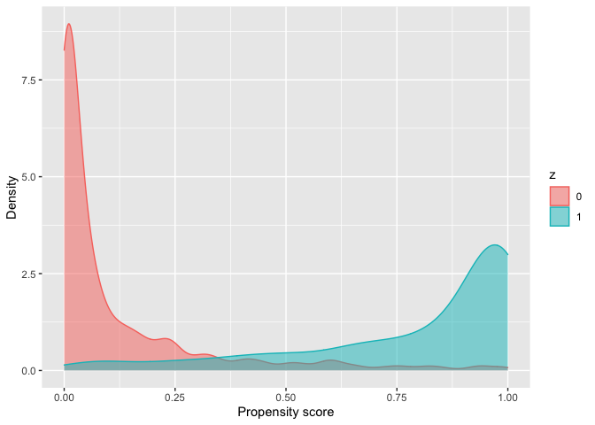
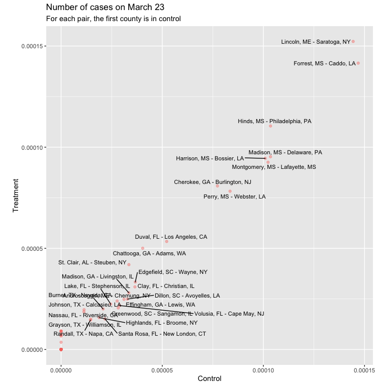

Code
================
Nov 20, 2020

# GOAL

Causal analysis of county-level COVID lockdowns impact through pairwise
matching and difference in difference

# Reading in libraries and files

``` r
library(tidyverse)
library(sensitivitymult)
library(lubridate)
library(RItools)
library(DOS2)
library(knitr)
library(optmatch)
source("utility.R")

covid_cases_file <- "covid_cases_time_series.csv"
lockdown_file <- "lockdown_us.csv"
county_file <- "covid_cleaned.csv"
```

## Cleaning case data

``` r
# cases <- 
#   read_csv("time_series_covid19_confirmed_US.csv") %>% 
#   mutate(fips = as.integer(FIPS)) %>% 
#   filter(!str_detect(Admin2, "Unassigned|Out of")) %>% 
#   filter(!is.na(fips)) %>% 
#   filter(!Province_State == "Puerto Rico") %>% 
#   select(
#     fips, everything(), -UID, -iso2, -iso3, -code3, -Province_State, 
#     -Country_Region, -Lat, -Long_, -Combined_Key, -FIPS,
#   ) %>% 
#   gather(key = "date", value = "cases", -Admin2, -fips) %>% 
#   arrange(fips) %>% 
#   # mutate(date = as.Date(date)) %>% 
#   separate(date, into = c("month", "day", "year"), sep = "/") %>% 
#   mutate(
#     year = str_c("20", year), 
#     date = make_date(year, month, day)
#   ) %>% 
#   select(fips, county_name = Admin2, date, cases) %>% 
#   filter(
#     date >= as.Date("2020-03-10"), 
#     date <= as.Date("2020-04-15"), 
#   )
# 
# cases %>% 
#   write_csv("covid_cases_time_series.csv")
```

## Reading in cleaned case data

``` r
cases <- 
  read_csv(covid_cases_file) %>% 
  group_by(fips, county_name) %>%
  mutate(new_cases = cases - lag(cases)) %>% 
  ungroup()
```

    ## 
    ## ── Column specification ────────────────────────────────────────────────────────
    ## cols(
    ##   fips = col_double(),
    ##   county_name = col_character(),
    ##   date = col_date(format = ""),
    ##   cases = col_double()
    ## )

## Getting number of cases on day zero and average pre and post cases

``` r
day_0 <- 
  cases %>% 
  filter(date == as.Date("2020-03-23")) %>% 
  select(fips, day_0 = cases) 

pre_post <- 
  cases %>% 
  mutate(
    days = 
      case_when(
      date >= as.Date("2020-03-19") & date <= as.Date("2020-03-23") ~ "pre_lockdown", 
      date >= as.Date("2020-04-02") & date <= as.Date("2020-04-06") ~ "post_lockdown", 
    )
  ) %>% 
  filter(!is.na(days)) %>% 
  group_by(fips, days) %>% 
  summarize(new_cases = mean(new_cases)) %>% 
  spread(key = days, value = new_cases)
```

    ## `summarise()` regrouping output by 'fips' (override with `.groups` argument)

## Reading in lockdown data

``` r
state_lockdowns <- 
  read_csv(lockdown_file) %>% 
  filter(is.na(County)) %>% 
  select(-Country, -County, -Type, -X6) %>% 
  rename(
    state = State, 
    lockdown_date_2 = Date
  )
```

    ## Warning: Missing column names filled in: 'X6' [6]

``` r
county_lockdowns <- 
  read_csv(lockdown_file) %>% 
  filter(!is.na(County)) %>% 
  select(-Country, -Type, -X6) %>% 
  rename(
    county_name = County,
    state = State, 
    lockdown_date_1 = Date 
  )
```

    ## Warning: Missing column names filled in: 'X6' [6]

## County level characteristics

``` r
data <- 
  read_csv(county_file) %>% 
  left_join(state_lockdowns, by = "state") %>% 
  left_join(county_lockdowns, by = c("state", "county_name")) %>% 
  mutate(
    lockdown = 
      case_when(
        lockdown_date_1 <= lockdown_date_2 ~ lockdown_date_1, 
        is.na(lockdown_date_1) & !is.na(lockdown_date_2) ~ lockdown_date_2,
        !is.na(lockdown_date_1) & is.na(lockdown_date_2) ~ lockdown_date_1
      )
  ) %>% 
  separate(lockdown, into = c("month", "day", "year"), sep = "/") %>% 
  mutate(
    year = str_c("20", year), 
    lockdown = make_date(year, month, day), 
    treatment = 
      case_when(
        lockdown <= as.Date("2020-03-23") ~ 1, 
        lockdown >= as.Date("2020-04-02") ~ 0
      )
  ) %>% 
  select(
    treatment, lockdown, everything(), -lockdown_date_1, -lockdown_date_2, 
    -confirmed, -deaths
  ) 
```

    ## 
    ## ── Column specification ────────────────────────────────────────────────────────
    ## cols(
    ##   .default = col_double(),
    ##   county_name = col_character(),
    ##   state = col_character()
    ## )
    ## ℹ Use `spec()` for the full column specifications.

## Histogram of date of lockdowns

``` r
data %>% 
  mutate(lockdown = as.character(lockdown)) %>% 
  ggplot(aes(lockdown)) + 
  geom_histogram(stat = "count") + 
  theme(
    axis.text.x = element_text(angle = 45, hjust = 1)
  ) + 
  labs(
    x = "Lockdown date", 
    y = "Number of counties", 
    title = "Histogram of county lockdown dates"
  )
```

    ## Warning: Ignoring unknown parameters: binwidth, bins, pad

<!-- --> \#\#
Plotting difference between states with lockdown and those without

``` r
test_df <- 
  data %>% 
  mutate(treatment = if_else(is.na(lockdown), 0, 1)) %>% 
  select(
    -c(
      lockdown, fips, county_name, state, month, day, year, 
      starts_with(c("age", "mort"))
    )
  )

test_res <- xBalance(treatment ~ ., data = test_df)

as_tibble(test_res$results) %>% 
  cbind(variable = names(test_df %>% select(-treatment))) %>% 
  mutate(variable = fct_reorder(variable, std.diff.unstrat)) %>% 
  ggplot(aes(std.diff.unstrat, variable)) + 
  geom_vline(xintercept = 0, color = "white", size = 2) + 
  geom_point() + 
  annotate(
    "label",
    label = c("Higher in states\nwith lockdown", "Higher in states\nwithout lockdown"),
    x = c(0.16, -0.16),
    y = 23, 
  ) + 
  labs(
    y = NULL, 
    title = "Standardized differences for counties with and without lockdown"
  )
```

<!-- -->

## Merging and final cleaning of the data

``` r
merged <- 
  data %>% 
  filter(!is.na(treatment)) %>% 
  left_join(pre_post, by = "fips") %>% 
  left_join(day_0, by = "fips") %>% 
  filter(post_lockdown >= 0 & pre_lockdown >= 0) %>% # dropping counties with negative averages
  mutate_at(
    vars(day_0, pre_lockdown, post_lockdown), 
    ~ (. / total_pop) 
  ) %>% 
  select(
    day_0, pre_lockdown, post_lockdown, everything(), 
    -month, -day, -year, -starts_with(c("age", "mort"))
  ) %>% 
  filter_all(~ !is.na(.)) %>% 
  mutate(y = post_lockdown - pre_lockdown) %>% 
  rename(z = treatment)

merged %>% 
  count(lockdown) %>% 
  kable()
```

| lockdown   |   n |
| :--------- | --: |
| 2020-03-19 |  58 |
| 2020-03-20 |   1 |
| 2020-03-21 | 125 |
| 2020-03-22 |  64 |
| 2020-03-23 | 158 |
| 2020-04-02 | 231 |
| 2020-04-03 | 282 |
| 2020-04-04 |  64 |
| 2020-04-05 |   1 |
| 2020-04-06 |  99 |
| 2020-04-07 |  45 |

## Checking balance between treatment and control groups

``` r
temp <- 
  merged %>% 
  select(-c(pre_lockdown, post_lockdown, y, fips, county_name, lockdown, state))

xBalance(z ~ ., data = temp) %>% 
  kable()
```

<table class="kable_wrapper">

<tbody>

<tr>

<td>

|                   | std.diff.unstrat |    z.unstrat | p.unstrat |
| :---------------- | ---------------: | -----------: | --------: |
| day\_0            |        0.4308689 |    6.8046368 | 0.0000000 |
| total\_pop        |        0.4998142 |    7.8380232 | 0.0000000 |
| asian             |        0.7365220 |   11.1980309 | 0.0000000 |
| black             |      \-0.4466092 |  \-7.0424662 | 0.0000000 |
| native            |        0.3026530 |    4.8302785 | 0.0000014 |
| female            |        0.0328440 |    0.5296283 | 0.5963697 |
| hispanic          |      \-0.1573792 |  \-2.5309261 | 0.0113762 |
| povall            |      \-0.6374335 |  \-9.8297112 | 0.0000000 |
| urban\_influence  |      \-0.4455404 |  \-7.0263517 | 0.0000000 |
| pov017            |      \-0.7961103 | \-11.9922083 | 0.0000000 |
| pov517            |      \-0.8024781 | \-12.0757615 | 0.0000000 |
| med\_hh\_income   |        0.9129399 |   13.4837129 | 0.0000000 |
| high\_school      |      \-0.6273695 |  \-9.6875356 | 0.0000000 |
| some\_college     |        0.4766015 |    7.4925559 | 0.0000000 |
| bachelor\_plus    |        0.8193937 |   12.2964635 | 0.0000000 |
| unemp             |        0.5868711 |    9.1096915 | 0.0000000 |
| labor\_force      |        0.5040500 |    7.9007840 | 0.0000000 |
| female\_life\_exp |        0.9852269 |   14.3618938 | 0.0000000 |
| male\_life\_exp   |        1.0366555 |   14.9655858 | 0.0000000 |
| female\_phy\_act  |        0.9818781 |   14.3219740 | 0.0000000 |
| male\_phy\_act    |        1.0109469 |   14.6660047 | 0.0000000 |
| female\_obesity   |      \-0.8683949 | \-12.9254470 | 0.0000000 |
| male\_obesity     |      \-0.6769418 | \-10.3822354 | 0.0000000 |
| female\_diabetes  |      \-0.9084418 | \-13.4279287 | 0.0000000 |
| male\_diabetes    |      \-1.0547767 | \-15.1741095 | 0.0000000 |

</td>

</tr>

</tbody>

</table>

``` r
plot(xBalance(z ~ ., data = temp))
```

<!-- -->

## Propensity score

``` r
propensity_fit <- glm(z ~ ., family = "binomial", data = temp)
```

    ## Warning: glm.fit: fitted probabilities numerically 0 or 1 occurred

``` r
temp %>% 
  mutate(z = as.factor(z)) %>% 
  mutate(p_score = propensity_fit$fitted.values) %>% 
  ggplot(aes(p_score, fill = z, color = z)) + 
  geom_density(alpha = 0.5) + 
  labs(
    x = "Propensity score", 
    y = "Density"
  )
```

<!-- -->

``` r
## Matching control and treat
matrix_1 <- 
  smahal(z = temp$z, X = as.matrix(temp %>% select(-z)))

## Adding caliper to force match on day_0
matrix_3 <- addcaliper(matrix_1, z = temp$z, p = propensity_fit$fitted.values, caliper = 0.1)

ms <- pairmatch(matrix_3, data = temp)

matched_1 <- cast.senm(merged, ms)
```

## Plotting the adjustment

``` r
plot(
  xBalance(
    z ~ day_0 + . + strata(ms) - 1, 
    data = temp %>% select(-starts_with(c("age", "mort")))
    )
  )
```

<!-- -->

## Getting pairs and force matching on day\_0

``` r
matched <- 
  cbind(merged, enframe(ms, name = NULL), p_score = propensity_fit$fitted.values) %>% 
  filter(!is.na(value))

matched_treat <- matched %>% filter(z == 1) 
matched_control <- matched %>% filter(z == 0) 

pairs <- 
  matched_treat %>% 
  left_join(matched_control, by = "value", suffix = c(".1", ".0")) %>% 
  filter(abs(day_0.1 - day_0.0) < 0.00001) 
```

## Getting average treatment effect

``` r
pairs %>% 
  summarize_at(vars(starts_with(c("pre", "post", "y"))), mean) %>% 
  kable()
```

| pre\_lockdown.1 | pre\_lockdown.0 | post\_lockdown.1 | post\_lockdown.0 |      y.1 |      y.0 |
| --------------: | --------------: | ---------------: | ---------------: | -------: | -------: |
|         1.4e-06 |         1.2e-06 |         3.41e-05 |         2.07e-05 | 3.27e-05 | 1.95e-05 |

``` r
## Comparing treatment to control
pairs %>% 
  select(y.0, y.1) %>% 
  gather(key = variable, value = value) %>% 
  mutate(Group = if_else(variable == "y.0", "Control", "Treatment")) %>% 
  ggplot(aes(value)) + 
  geom_histogram(alpha = 1) + 
  labs(
    x = "Difference", 
    y = "Number", 
    title = "Histograms of the difference between\npre-lockdown and post-lockdown for matched counties"
  ) + 
  facet_wrap(vars(Group), ncol = 1)
```

    ## `stat_bin()` using `bins = 30`. Pick better value with `binwidth`.

<!-- -->

## Fischer’s test

``` r
senm(
  y = matched$y, 
  z = matched$z, 
  mset = matched_1$mset, 
  gamma = 1.2, 
  inner = 0, 
  trim = Inf
)
```

    ## $pval
    ## [1] 1.261061e-09
    ## 
    ## $deviate
    ## [1] 5.960017
    ## 
    ## $statistic
    ## [1] 0.01204228
    ## 
    ## $expectation
    ## [1] 0.001520425
    ## 
    ## $variance
    ## [1] 3.116665e-06

## Wilcox test

``` r
wilcox.test(pairs$y.0, pairs$y.1)
```

    ## 
    ##  Wilcoxon rank sum test with continuity correction
    ## 
    ## data:  pairs$y.0 and pairs$y.1
    ## W = 12697, p-value = 0.1037
    ## alternative hypothesis: true location shift is not equal to 0

## Visualizing pairs

``` r
state_abbr <- 
  read_csv("state_names.csv") %>% 
  select(-Abbrev)
```

    ## 
    ## ── Column specification ────────────────────────────────────────────────────────
    ## cols(
    ##   State = col_character(),
    ##   Abbrev = col_character(),
    ##   Code = col_character()
    ## )

``` r
# png("pairs.png", width = 8 , height = 8, units = "in", res = 300) 

pairs %>% 
  left_join(state_abbr, by = c("state.0" = "State")) %>% 
  left_join(state_abbr, by = c("state.1" = "State"), suffix = c(".0", ".1")) %>% 
  mutate(
    combined_name = 
      str_c(county_name.0, ", ", Code.0, " - ", county_name.1, ", ", Code.1)
  ) %>% 
  ggplot(aes(day_0.0, day_0.1)) +
  geom_point(alpha = 0.4, color = "#F8766D") + 
  ggrepel::geom_text_repel(
    aes(label = combined_name), 
    data = . %>% filter(day_0.1 >= 0.00001 | day_0.0 >= 0.00001), 
    size = 3
  ) + 
  labs(
    x = "Control", 
    y = "Treatment", 
    title = "Number of cases on March 23", 
    subtitle = "For each pair, the first county is in control"
  ) + 
  coord_fixed()
```

<!-- -->

``` r
# dev.off()
```
